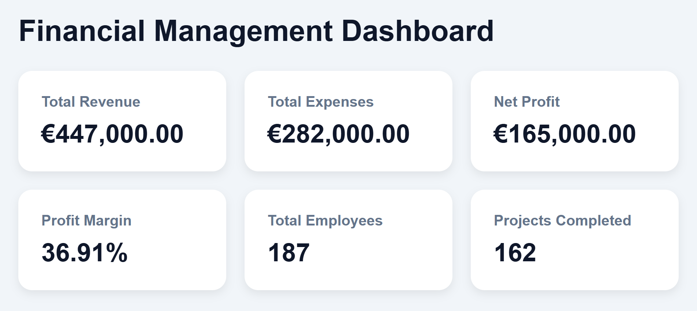
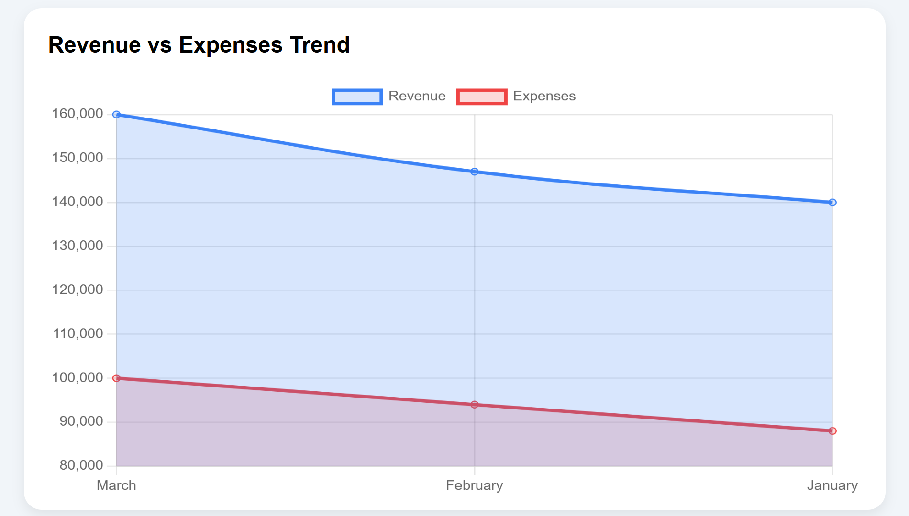
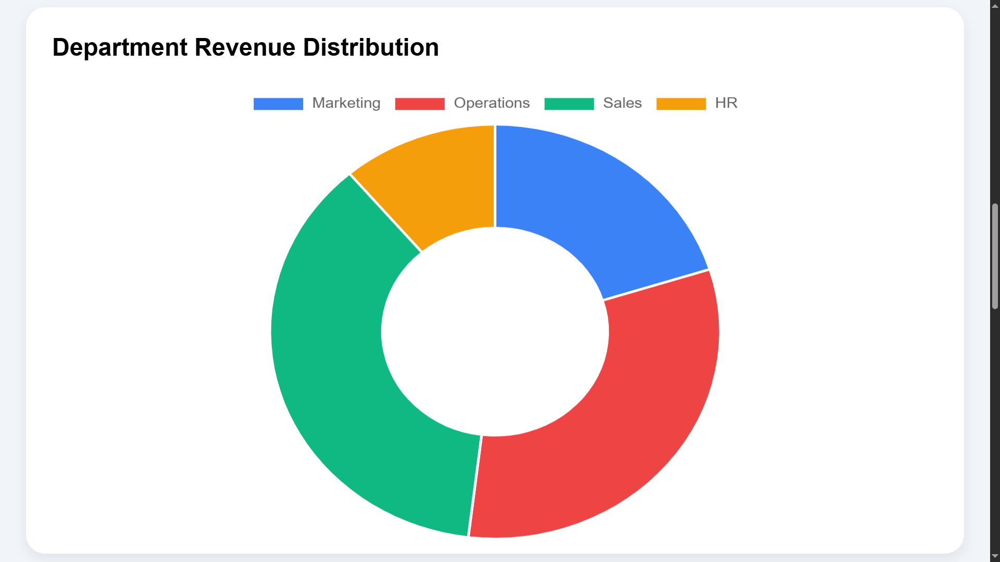
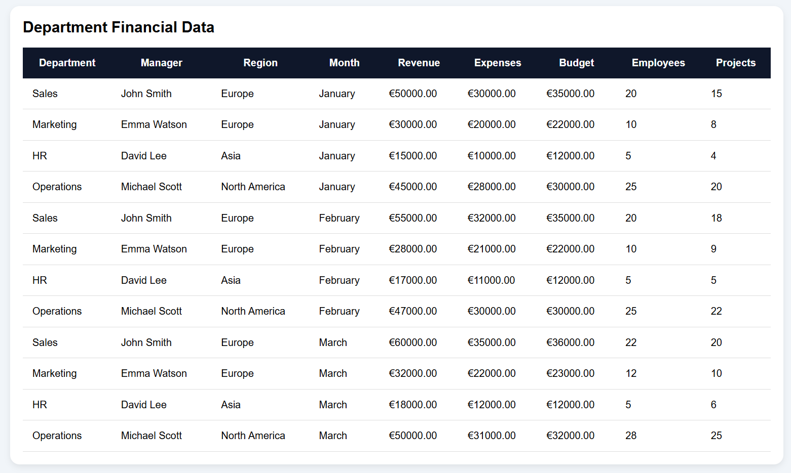

# Financial Management BI Dashboard

A modern Business Intelligence dashboard project built using PHP, PostgreSQL, JavaScript, HTML, and CSS.

This project focuses on financial analytics, KPI tracking, department performance, and management reporting using real business intelligence concepts.

---

# Dashboard Screenshots
  
## Dashboard Overview



---

## KPI Analytics Section



---

## Financial Charts



---

## Department Analytics Table




---

# Project Overview

The dashboard helps analyze:

- Revenue trends
- Expense analysis
- Net profit
- Profit margins
- Department performance
- Employee statistics
- Project completion metrics
- Regional financial data

The project simulates a real-world enterprise financial management system used for business reporting and decision-making.

---

# Features

## KPI Analytics
- Total Revenue
- Total Expenses
- Net Profit
- Profit Margin
- Total Employees
- Projects Completed

---

## Interactive Charts
- Revenue vs Expenses Trend
- Department Revenue Distribution

---

## Management Analytics
- Department-wise analysis
- Manager performance
- Regional insights
- Financial reporting table

---

# Technologies Used

## Frontend
- HTML
- CSS
- JavaScript
- Chart.js

## Backend
- PHP

## Database
- PostgreSQL
- pgAdmin

## Development Tools
- Visual Studio Code
- XAMPP
- Anaconda Navigator

---

# Database Structure

The project uses a PostgreSQL database containing:

- Department
- Manager
- Region
- Revenue
- Expenses
- Budget
- Employees
- Projects Completed

---

# Business Intelligence Concepts Used

- KPI Engineering
- Financial Analytics
- Data Visualization
- SQL Aggregation
- Dashboard Design
- Management Reporting
- Business Analytics

---

# How to Run the Project

## Step 1
Install:
- XAMPP
- PostgreSQL
- pgAdmin

---

## Step 2
Move project folder to:

```text
C:\xampp\htdocs\
```

---

## Step 3
Start Apache using XAMPP.

---

## Step 4
Create PostgreSQL database:

```sql
financial_dashboard
```

---

## Step 5
Run SQL queries to create tables and insert data.

---

## Step 6
Open browser:

```text
http://localhost/financial-dashboard/
```

---

# Learning Outcomes

This project helped in learning:

- Backend integration using PHP
- PostgreSQL database management
- Financial KPI reporting
- Business Intelligence dashboards
- Interactive chart visualization
- Management analytics systems

---

# Future Improvements

Planned improvements:

- Login authentication
- Date filters
- Forecast analytics
- Export reports
- Dark mode
- AI-powered analytics
- Responsive mobile design

---

# Author

Hrushikesh Kudtarkar

M.Sc. Industrial Engineering and International Management

Business Intelligence & Data Analytics Enthusiast
